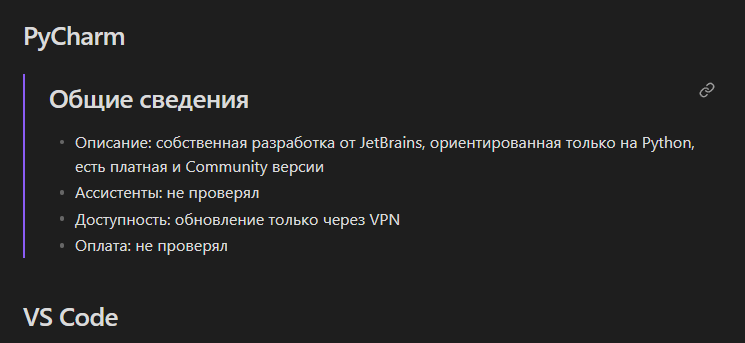

# Заметки о ИИ и разработке на [Obsidian](https://obsidian.md/)

Оптимизированы под просмотр через Obsidian и GitHub, хотя не всё работает одинаково, увы. На текущий момент в GitHub не работают Wiki-like ссылки, а также подстановка секций из документов:

Для просмотра необходимо выбрать интересующий документ, например, [Data Engineering](Data%20Engineering.md), многие документы связаны между собой ссылками.

Приятного изучения!