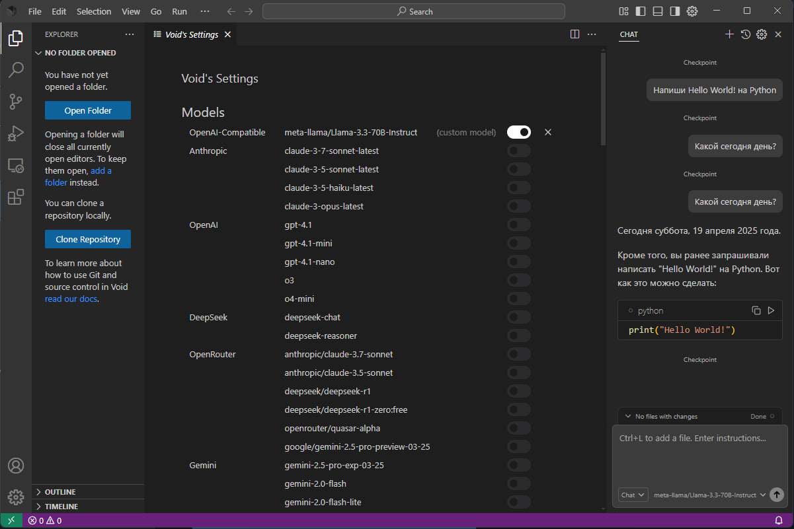

# [Void](https://voideditor.com/download-beta)
## Общие сведения
* Описание: Среда разработки на основе [VS Code](VS%20Code.md) с поддержкой ИИ по аналогии с [Cursor](Cursor.md), но без проприетарных моделей
* Ассистенты: встроенного нет. Можно подключить сторонние модели по OpenAI протоколу или локальные модели.
* Доступность: обновление без VPN
* Оплата: не требуется
## Возможности
* использование плагинов [VS Code](VS%20Code.md), импорт из уже настроенной [VS Code](VS%20Code.md) плагинов и настроек;
* использование как встроенных моделей, так и сторонних проприетарных через API, удалось подключить модели с [IO.net](IO.net):

## Что посмотреть и почитать
* 
## Нерешенные проблемы
* Обновление (v 1.2.5) не смогло нормально установиться, пришлось удалять старую версию вручную